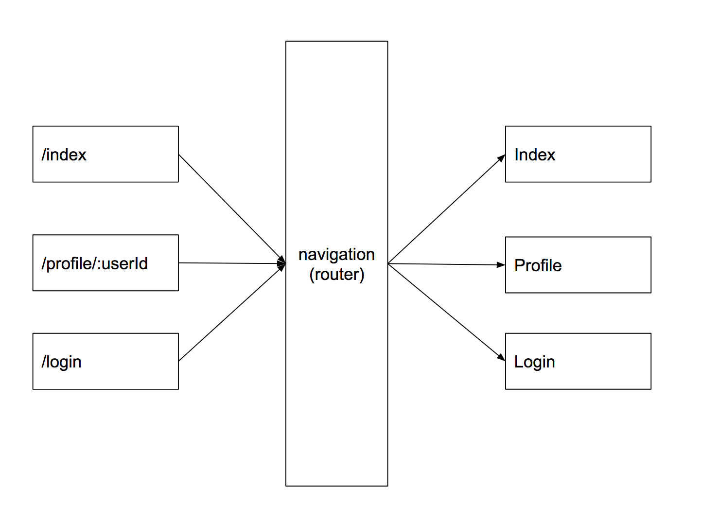
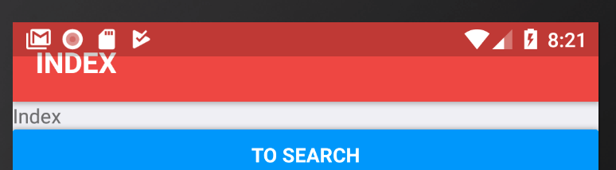

## Migrate Experimental to React-Navigation

#### ichi

---

@title[Introduction]

### Introduction

---?code=codes/expe1.js

@title[Base of React-Navigation-Experimental]

@[1](define enterance Component)
@[70-76](use Experimental)
@[45-53](header definition)
@[2-15](right header definition)
@[17-29](left header definition)
@[31-43](center header definition)
@[55-68](content definition)

---?code=codes/navi1.js

@title[Base of React-Navigation]

@[1](define enterance Component)
@[28-30](use React-Navigation)
@[2-25](define all screen)

---?code=codes/expe1.js

@title[Intro for Migrate about Component]

@[73-74](rewrite header and scene as a screen defined by object)
@[55-68](the scenes are redefined in the screen as a property)
@[48-50](the headers are redefined in the screen as a property)

---

@title[Migrate]

### Install [React-Navigation](https://reactnavigation.org/)(2.0.0-rc2)

* Required
  * react-native-vector-icons

+++

@title[Get Started]

### Get Started

* Create new routing file for react-navigation
  * Create a simple routing

+++

@title[Redux]

### Redux

* [redux-integration](https://reactnavigation.org/docs/redux-integration.html#step-by-step-guide)
* middleware
* reducer
* use in simple routing
  * use dispatch to navigate
  * get project data in store
* [rewrite navigation actions](https://reactnavigation.org/docs/navigation-actions.html)

+++

@title[Devices]

### iPhone X

* [handling iphone x](https://reactnavigation.org/docs/handling-iphonex.html)
  * [SafeAreaView example](https://github.com/react-navigation/react-navigation/tree/master/examples/SafeAreaExample)

+++

### Android

* [back button issue](https://github.com/react-navigation/react-navigation/issues/1214)
* [header style](https://github.com/react-navigation/react-navigation/issues/12)
* splash screen

+++

### Project routes

* Choose which navigator to use
  * stack
  * tab
  * switch
  * drawer

+++

### Nested navigation

* [StacksOverTabs](https://github.com/react-navigation/react-navigation/blob/master/examples/NavigationPlayground/js/StacksOverTabs.js)
* [StacksInTabs](https://github.com/react-navigation/react-navigation/blob/master/examples/NavigationPlayground/js/StacksInTabs.js)

+++

### API Reference

* [api reference](https://reactnavigation.org/docs/deep-linking.html)

+++

### Settings

* [stack navigator](https://reactnavigation.org/docs/stack-navigator.html#stacknavigatorconfig)
* [customize](https://reactnavigation.org/docs/header-buttons.html)
  * header
  * back button
  * mode - modal

+++

### Flow

* [auth flow](https://reactnavigation.org/docs/auth-flow.html#implement-our-authentication-loading-screen)
* [deep link](https://reactnavigation.org/docs/deep-linking.html)
* [screen tracking](https://reactnavigation.org/docs/screen-tracking.html)

+++

### Acceess Data

* [pass parameters between navigations](https://reactnavigation.org/docs/params.html)
* [acceess navigation props from component](https://reactnavigation.org/docs/connecting-navigation-prop.html)

+++

### Transitioner

* [doc](https://reactnavigation.org/docs/transitioner.html)
* [Custom Transition](https://medium.com/async-la/custom-transitions-in-react-navigation-2f759408a053)
